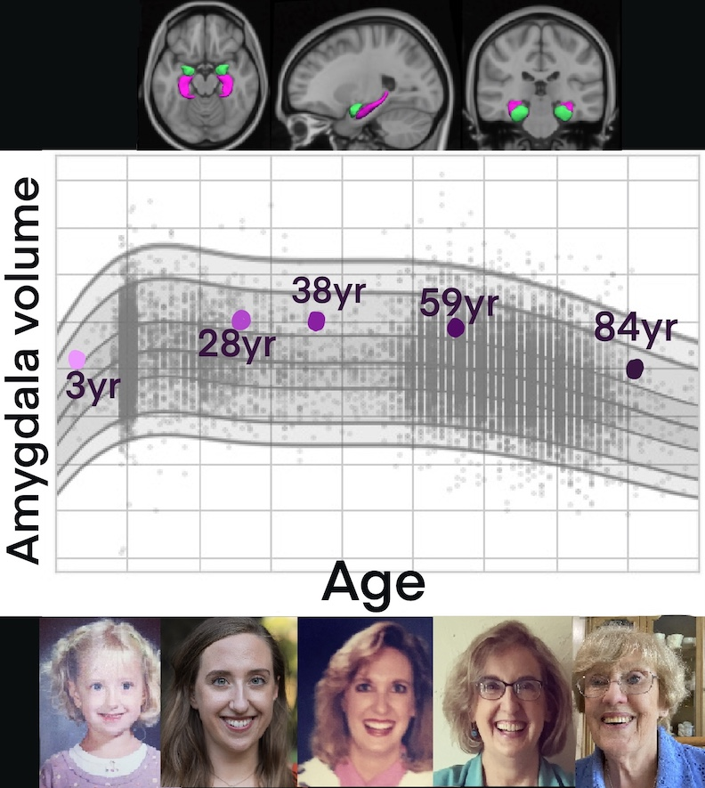

# braincharts

 

## Pre-trained models, code, documentation, and supporting files for: 
### Charting Brain Growth and Aging at High Spatial Precision
In press at [eLife](https://elifesciences.org/articles/72904).

**Training the reference cohort** 

**Fit pre-trained model to new (transfer) data** 

**Abstract:** Defining reference models for population variation, and the ability to study individual deviations is essential for understanding inter-individual variability and its relation to the onset and progression of medical conditions. In this work, we assembled a reference cohort of neuroimaging data from 82 sites (N=58,836; ages 2-100) and use normative modeling to characterize lifespan trajectories of cortical thickness and subcortical volume. Models are validated against a manually quality checked subset (N=24,354) and we provide an interface for transferring to new data sources. We showcase the clinical value by applying the models to a transdiagnostic psychiatric sample (N=1,985), showing they can be used to quantify variability underlying multiple disorders whilst also refining case-control inferences.  These models will be augmented with additional samples and imaging modalities as they become available. This provides a common reference platform to bind results from different studies and ultimately paves the way for personalized clinical decision making. 

## **Interactive visualizations of evaluation metrics:**

[Heroku app for exploring explained variance](https://brainviz-app.herokuapp.com/)

Click on the 'open in colab' button below to launch the interactive visualization and explore the evaluation metrics yourself. There is a separate visualization for each test set and evaluation metric. 

### **1. Full test set (including 10 randomized split halfs)**

Explained Variance 

MSLL 

Kurtosis 

Skew 

### **2. mQC test set**

Explained Variance 

MSLL 

Kurtosis 

Skew 

### **3. Patients test set**

Explained Variance 

MSLL 

Kurtosis 

Skew 

### **4. Transfer test set**

Explained Variance 

MSLL 

Kurtosis 

Skew 
